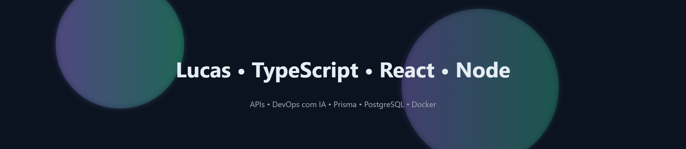

<!-- Banner animado -->

  

<h1 align="center">Olá, eu sou o Lucas 👋</h1>

  <!-- Typing effect -->
  

  
  
  

### 🚀 Tech Stack (core)

  
  
  
  
  
  
  

### 🌟 Destaques (auto)
<!-- AUTOGERADO: não edite entre estas linhas -->
<!-- TOP-REPOS:START -->
<!-- TOP-REPOS:END -->

### 🧾 Últimos commits (auto)
<!-- COMMITS:START -->
<!-- COMMITS:END -->

### 📈 Métricas rápidas

  
  

### 🐍 Snake (auto)

  

> *Dica:* os blocos **Destaques** e **Últimos commits** atualizam sozinhos (via Actions).
